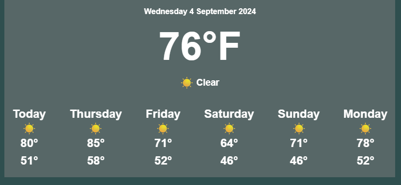

# Remix + Tomorrow.io Weather App

This was an exercise to see how we can use Remix to serve API data without exposing our API keys.

I may add additional features in the future, but for now it displays the current temperature/weather and a 5-day forecast.

### Installation

1. Run `npm i` or `npm install`
2. Create a `.env` file with a variable `TOMORROW_API_KEY` containing your key from Tomorrow.io.
3. Run `npm run dev`

